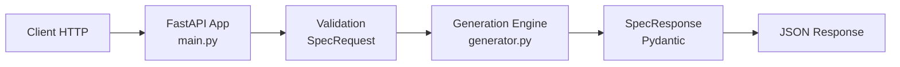

# Architecture Complete - SCRUM-5 Copilot Spec Generator

## 1. Contexte

Le repository implemente un service MVP de generation de specifications structurees a partir d un brief produit.

Traceabilite:

- Ticket Jira: SCRUM-5
- Snapshot ticket: [docs/tickets/SCRUM-5.md](./tickets/SCRUM-5.md)

## 2. Objectifs du systeme

Objectifs metier:

- accelerer la production de specs utilisables par les equipes produit et engineering,
- standardiser le format de sortie pour simplifier revue et execution,
- reduire l ambiguite avant implementation.

Objectifs techniques:

- exposer une API HTTP simple,
- garantir une structure de sortie stable,
- valider strictement les payloads entrants.

## 3. Vue d architecture

L architecture suit une separation simple en 3 couches:

- API layer (FastAPI): exposition des endpoints et validation automatique,
- Domain layer (generator): logique de generation de contenu,
- Data model layer (Pydantic): contrats d entree et de sortie.

## 4. Structure du projet

```text
scrum-5-copilot-spec-generator/
  docs/
    ARCHITECTURE.md
    README.md
    tickets/
      SCRUM-5.md
  src/
    copilot_spec_generator/
      __init__.py
      main.py
      models.py
      generator.py
  tests/
    test_generator.py
  README.md
  pyproject.toml
```

## 5. Composants et responsabilites

### 5.1 API Layer - src/copilot_spec_generator/main.py

Responsabilites:

- creer l application FastAPI,
- exposer les routes HTTP,
- mapper payload JSON vers `SpecRequest`,
- retourner une reponse conforme a `SpecResponse`.

Routes:

- `GET /health` -> verification de sante (`{"ok": true}`),
- `POST /generate-spec` -> generation de spec.

### 5.2 Domain Layer - src/copilot_spec_generator/generator.py

Responsabilites:

- produire le contenu de specification,
- maintenir un schema de sortie stable,
- injecter dynamiquement les contraintes du payload.

Comportement:

- `context` combine `request_type` et `brief`,
- `objectives` et `scope` suivent un template de base,
- `requirements` contient la demande principale + contraintes,
- `acceptance_criteria` est fabrique par `_line_items`,
- `risks` et `test_plan` sont proposes de maniere standardisee.

### 5.3 Data Model Layer - src/copilot_spec_generator/models.py

`SpecRequest`:

- `title`: string, min_length=3,
- `brief`: string, min_length=10,
- `request_type`: enum (`feature`, `bugfix`, `integration`, `migration`),
- `constraints`: liste de strings.

`SpecResponse`:

- `context`,
- `objectives`,
- `scope`,
- `requirements`,
- `acceptance_criteria`,
- `risks`,
- `test_plan`.

### 5.4 Test Layer - tests/test_generator.py

Le test unitaire verifie que toutes les sections obligatoires sont presentes dans la reponse.

Couverture actuelle:

- validation presence des sections.

Non couvert actuellement:

- tests API HTTP,
- qualite semantique des contenus,
- scenarios limites et erreurs de validation detaillees.

## 6. Flux de bout en bout

1. Le client envoie un JSON sur `POST /generate-spec`.
2. FastAPI valide le payload via `SpecRequest`.
3. Le handler appelle `generate_spec(payload)`.
4. Le moteur construit un `SpecResponse`.
5. FastAPI serialise la reponse en JSON.
6. Le client recupere une specification normalisee.

## 7. Diagramme (vue logique)



## 8. Contrat API

### 8.1 Healthcheck

- Methode: `GET`
- Path: `/health`
- Reponse:

```json
{
  "ok": true
}
```

### 8.2 Generation de spec

- Methode: `POST`
- Path: `/generate-spec`
- Content-Type: `application/json`

Exemple request:

```json
{
  "title": "Add discount code flow",
  "brief": "Allow users to apply a discount code in checkout and show validation errors.",
  "request_type": "feature",
  "constraints": [
    "No breaking API changes",
    "Keep checkout under 2s p95"
  ]
}
```

Exemple response:

```json
{
  "context": "Request type: feature. Problem statement: Allow users to apply a discount code in checkout and show validation errors.",
  "objectives": [
    "Deliver a clear specification for: Add discount code flow",
    "Align product and engineering on expected behavior",
    "Reduce ambiguity before implementation"
  ],
  "scope": [
    "Functional behavior",
    "Technical approach and API impacts",
    "Validation rules and edge cases"
  ],
  "requirements": [
    "Primary requirement: Allow users to apply a discount code in checkout and show validation errors.",
    "Provide output sections in a stable schema",
    "Constraint: No breaking API changes",
    "Constraint: Keep checkout under 2s p95"
  ],
  "acceptance_criteria": [
    "AC 1: Spec contains context, objectives, scope, requirements, risks, and tests",
    "AC 2: Spec contains context, objectives, scope, requirements, risks, and tests",
    "AC 3: Spec contains context, objectives, scope, requirements, risks, and tests"
  ],
  "risks": [
    "Input brief may be incomplete",
    "Generated text may require manual review",
    "Domain-specific constraints could be missing"
  ],
  "test_plan": [
    "Unit test output structure and required sections",
    "Validate behavior with empty and rich constraints",
    "Manual review with a real product brief"
  ]
}
```

## 9. Build, run, test

Prerequis:

- Python >= 3.11

Installation:

```bash
python -m venv .venv
source .venv/bin/activate
pip install -e .
```

Run:

```bash
uvicorn copilot_spec_generator.main:app --host 0.0.0.0 --port 8000 --reload
```

Ou via script pyproject:

```bash
copilot-spec-generator
```

Tests:

```bash
pytest -q
```

## 10. Limites connues

Limites MVP:

- pas de moteur LLM branche,
- pas de stockage des generations,
- pas d authentification,
- pas de rate limiting,
- peu de tests de non-regression API.

Point de vigilance code:

- `constraints` est initialise avec une liste mutable par defaut dans `SpecRequest`.
- recommandation: remplacer par `Field(default_factory=list)`.

## 11. Securite et operations

Etat actuel:

- endpoint health basique,
- logs standards FastAPI/Uvicorn.

Recommandations:

- ajouter auth (API key ou OAuth2/JWT),
- ajouter rate limiting,
- ajouter logs structures et correlation id,
- ajouter metriques latence/erreurs,
- renforcer la gestion d erreurs metier.

## 12. Roadmap recommandee

1. V1.1 - Hardening API
- corriger default mutable pour `constraints`,
- ajouter tests API integration,
- etendre exemples OpenAPI.

2. V1.2 - Generation intelligente
- introduire un backend LLM optionnel,
- separer generation, validation, post-traitement,
- conserver un mode fallback deterministe.

3. V1.3 - Industrialisation
- securite complete,
- observabilite complete,
- pipeline CI/CD avec quality gates.

## 13. Definition of Done documentaire

La documentation est consideree complete pour le MVP si:

- l architecture et les composants sont decrits,
- les flux et le contrat API sont explicites,
- les limites/risques sont identifies,
- les evolutions prioritaires sont tracees.

## 14. Metadata

- Repository: `mabdelli-ml/scrum-5-copilot-spec-generator`
- Version document: `1.0`
- Date: `2026-05-03`
