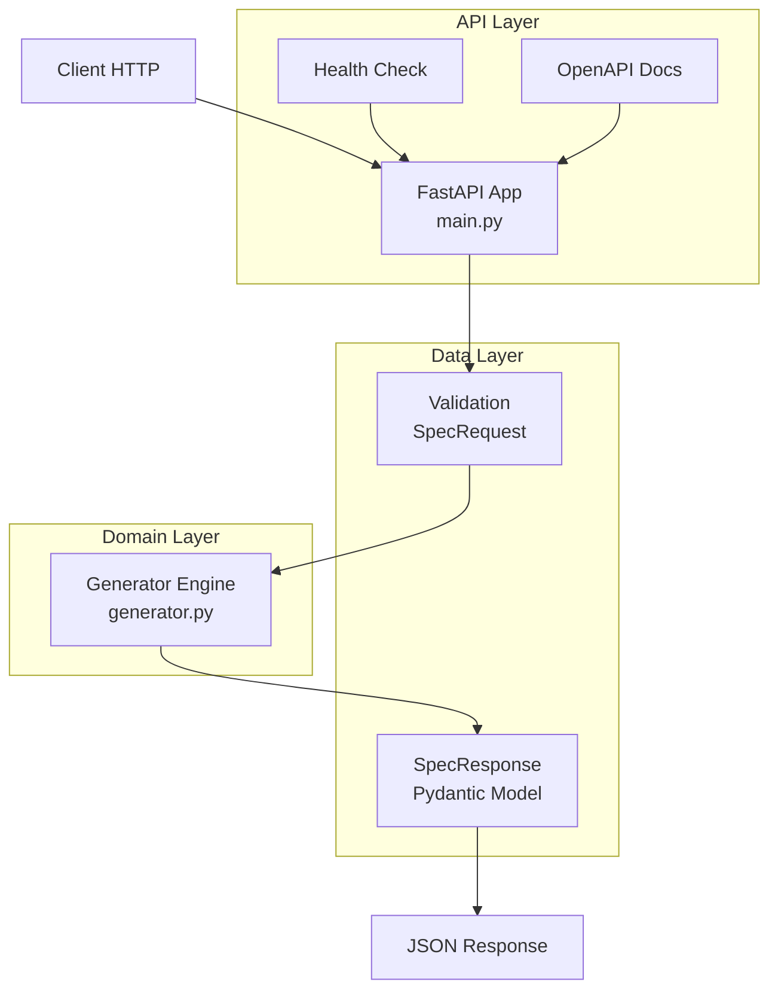
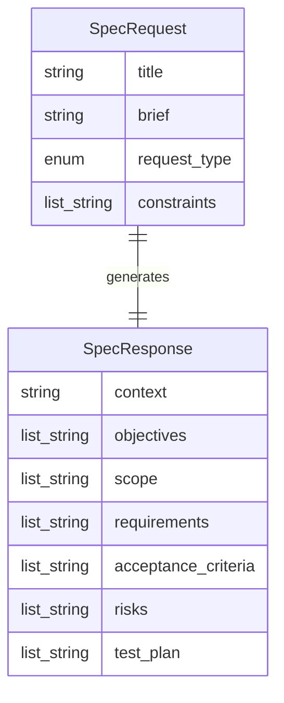
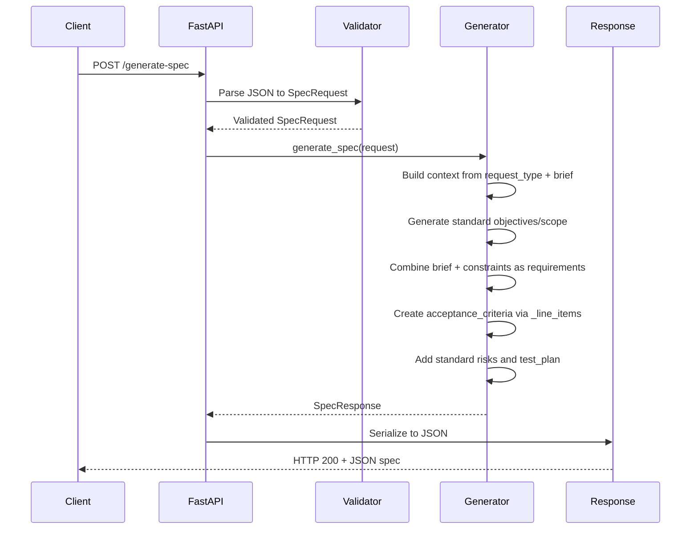

# Architecture — SCRUM-5 Copilot Spec Generator

## 1. Vue d'ensemble

### Description du projet
Service MVP de génération de spécifications structurées à partir d'un brief produit. L'objectif est d'accélérer la production de specs utilisables par les équipes produit et engineering, en standardisant le format de sortie et en réduisant l'ambiguïté avant implémentation.

### Stack technique
- **Langage** : Python ≥ 3.11
- **Framework web** : FastAPI 0.111.0+
- **Validation de données** : Pydantic 2.7.0+
- **Serveur ASGI** : Uvicorn 0.30.0+
- **Build system** : Hatchling 1.25.0+
- **Tests** : pytest (implicite)

### Tableau récapitulatif

| Composant | Technologie | Version | Rôle |
|-----------|-------------|---------|------|
| API Framework | FastAPI | ≥0.111.0 | Exposition HTTP et validation automatique |
| Data Validation | Pydantic | ≥2.7.0 | Modèles de données et sérialisation |
| ASGI Server | Uvicorn | ≥0.30.0 | Serveur d'application |
| Build System | Hatchling | ≥1.25.0 | Packaging et distribution |
| Runtime | Python | ≥3.11 | Environnement d'exécution |

## 2. Architecture technique

### 2.1 Diagramme d'architecture


### 2.2 Structure du projet
```
scrum-5-copilot-spec-generator/
├── docs/                    # Documentation technique
│   ├── ARCHITECTURE.md      # Architecture complète (existante)
│   ├── README.md           # Index documentation
│   └── tickets/            # Traçabilité tickets Jira
│       └── SCRUM-5.md      # Snapshot ticket source
├── src/                    # Code source principal
│   └── copilot_spec_generator/
│       ├── __init__.py     # Package marker
│       ├── main.py         # Application FastAPI et endpoints
│       ├── models.py       # Modèles Pydantic (SpecRequest/SpecResponse)
│       └── generator.py    # Moteur de génération de spécifications
├── tests/                  # Tests unitaires
│   └── test_generator.py   # Tests du moteur de génération
├── pyproject.toml          # Configuration build et dépendances
├── README.md               # Documentation utilisateur
└── .gitignore             # Exclusions Git
```

### 2.3 Composants

#### API Layer - main.py
- **Rôle** : Exposition des endpoints HTTP et orchestration
- **Fichiers** : `src/copilot_spec_generator/main.py`
- **Dépendances** : FastAPI, Uvicorn, models.py, generator.py
- **Responsabilités** :
  - Création de l'application FastAPI
  - Définition des routes (`/health`, `/generate-spec`)
  - Validation automatique des payloads JSON
  - Sérialisation des réponses

#### Domain Layer - generator.py
- **Rôle** : Logique métier de génération de spécifications
- **Fichiers** : `src/copilot_spec_generator/generator.py`
- **Dépendances** : models.py
- **Responsabilités** :
  - Production du contenu de spécification structuré
  - Application des templates de base pour chaque section
  - Injection dynamique des contraintes utilisateur
  - Génération des critères d'acceptation via `_line_items()`

#### Data Layer - models.py
- **Rôle** : Définition des contrats d'entrée et sortie
- **Fichiers** : `src/copilot_spec_generator/models.py`
- **Dépendances** : Pydantic
- **Responsabilités** :
  - Validation stricte des inputs (`SpecRequest`)
  - Structure normalisée des outputs (`SpecResponse`)
  - Types énumérés pour `request_type`

### 2.4 Patterns et conventions

#### Patterns architecturaux
- **Layered Architecture** : Séparation API/Domain/Data
- **DTO Pattern** : SpecRequest/SpecResponse comme objets de transfert
- **Template Method** : Génération standardisée avec injection de variables

#### Conventions de nommage
- **Modules** : snake_case (`copilot_spec_generator`)
- **Classes** : PascalCase (`SpecRequest`, `SpecResponse`)
- **Fonctions** : snake_case (`generate_spec`, `_line_items`)
- **Variables** : snake_case

#### Gestion de la configuration
- Configuration via `pyproject.toml` (build system, dépendances, scripts)
- Pas de configuration runtime externe identifiée
- Port par défaut : 8000

## 3. API Reference

### Endpoints

| Méthode | Route | Description | Auth |
|---------|-------|-------------|------|
| GET | `/health` | Vérification de santé du service | Aucune |
| POST | `/generate-spec` | Génération de spécification structurée | Aucune |

### Détail par endpoint

#### GET /health
- **Paramètres** : Aucun
- **Format de réponse** :
```json
{
  "ok": true
}
```
- **Codes d'erreur** : 200 uniquement
- **Exemple d'appel** :
```bash
curl http://127.0.0.1:8000/health
```

#### POST /generate-spec
- **Paramètres body** :
  - `title` (string, min_length=3) : Titre de la demande
  - `brief` (string, min_length=10) : Description du problème
  - `request_type` (enum) : Type de demande (feature|bugfix|integration|migration)
  - `constraints` (list[string]) : Liste des contraintes à respecter

- **Format de réponse** :
```json
{
  "context": "string",
  "objectives": ["string"],
  "scope": ["string"], 
  "requirements": ["string"],
  "acceptance_criteria": ["string"],
  "risks": ["string"],
  "test_plan": ["string"]
}
```

- **Codes d'erreur** : 200 (succès), 422 (validation error)

- **Exemple d'appel** :
```bash
curl -X POST http://127.0.0.1:8000/generate-spec \
  -H "Content-Type: application/json" \
  -d '{
    "title": "Add discount code flow",
    "brief": "Allow users to apply a discount code in checkout and show validation errors.",
    "request_type": "feature",
    "constraints": ["No breaking API changes", "Keep checkout under 2s p95"]
  }'
```

## 4. Modèle de données

### 4.1 Diagramme entité-relation


### 4.2 Entités

#### SpecRequest

| Champ | Type | Contraintes | Description |
|-------|------|-------------|-------------|
| title | string | min_length=3 | Titre de la demande |
| brief | string | min_length=10 | Description détaillée du problème |
| request_type | Literal | "feature"\|"bugfix"\|"integration"\|"migration", default="feature" | Type de demande |
| constraints | list[string] | default=[] | Liste des contraintes à respecter |

#### SpecResponse

| Champ | Type | Contraintes | Description |
|-------|------|-------------|-------------|
| context | string | required | Contexte reformulé de la demande |
| objectives | list[string] | required | Objectifs de la spécification |
| scope | list[string] | required | Périmètre fonctionnel et technique |
| requirements | list[string] | required | Exigences principales et contraintes |
| acceptance_criteria | list[string] | required | Critères d'acceptation générés |
| risks | list[string] | required | Risques identifiés |
| test_plan | list[string] | required | Plan de test recommandé |

### 4.3 Relations
- **SpecRequest → SpecResponse** : Transformation 1:1 via `generate_spec()`
- Pas de persistance, traitement stateless

### 4.4 Migrations / Schéma
Aucune base de données identifiée. Modèles Pydantic uniquement pour validation/sérialisation.

## 5. Flux de données

### 5.1 Diagramme de séquence principal


### 5.2 Inputs / Outputs
- **Sources de données** : 
  - JSON payload via HTTP POST
  - Templates statiques dans `generator.py`
- **Sorties produites** :
  - JSON structuré conforme à SpecResponse
  - 7 sections standardisées (context, objectives, scope, requirements, acceptance_criteria, risks, test_plan)
- **Transformations appliquées** :
  - Concaténation `request_type` + `brief` → `context`
  - Injection `title` dans objectifs
  - Ajout préfixe "Constraint:" pour chaque contrainte
  - Génération AC via pattern "AC {i}: {template}"

## 6. Sécurité et authentification

### État actuel
- **Authentification** : Aucune
- **Autorisation** : Aucune
- **HTTPS** : Non configuré (développement local)
- **Rate limiting** : Absent
- **Validation** : Pydantic automatique pour les types/contraintes

### Variables d'environnement sensibles
Aucune variable d'environnement identifiée dans le code actuel.

### Recommandations sécurité
- Ajouter authentification (API key ou JWT)
- Implémenter rate limiting
- Configurer HTTPS en production
- Ajouter logs de sécurité et correlation IDs

## 7. Configuration et environnement

### Variables d'environnement requises
Aucune variable d'environnement requise pour le MVP actuel.

### Fichiers de configuration

| Fichier | Rôle | Contenu |
|---------|------|---------|
| pyproject.toml | Build et dépendances | Métadonnées projet, dépendances Python, scripts |
| .gitignore | Exclusions Git | Fichiers temporaires et environnements virtuels |

### Profils
Un seul profil identifié : développement local avec reload activé.

## 8. Déploiement

### 8.1 Prérequis
- **Python** : ≥ 3.11
- **Système** : Linux/macOS/Windows
- **Mémoire** : Minimal (FastAPI léger)
- **Réseau** : Port 8000 disponible

### 8.2 Installation
```bash
# Cloner le repository
git clone <repository-url>
cd scrum-5-copilot-spec-generator

# Créer environnement virtuel
python -m venv .venv
source .venv/bin/activate  # Linux/macOS
# .venv\Scripts\activate   # Windows

# Installer en mode développement
pip install -e .
```

### 8.3 Lancement
```bash
# Via uvicorn direct
uvicorn copilot_spec_generator.main:app --reload

# Via script pyproject.toml  
copilot-spec-generator

# Avec configuration custom
uvicorn copilot_spec_generator.main:app --host 0.0.0.0 --port 8000 --reload
```

### 8.4 Docker
Aucun Dockerfile ou docker-compose.yml identifié dans l'arborescence actuelle.

### 8.5 CI/CD
Aucun pipeline CI/CD identifié (.github/workflows, Jenkinsfile, .gitlab-ci.yml absents).

## 9. Tests

### Framework de test
- **pytest** (implicite, standard Python)
- Un seul test : `tests/test_generator.py`

### Structure des tests
```
tests/
└── test_generator.py    # Tests unitaires du moteur de génération
```

### Comment lancer les tests
```bash
# Installation pytest (si pas déjà installé)
pip install pytest

# Exécution des tests
pytest -q

# Avec verbose
pytest -v
```

### Couverture actuelle
- ✅ Validation présence des sections obligatoires dans SpecResponse
- ❌ Tests d'intégration API HTTP
- ❌ Tests de validation des erreurs Pydantic
- ❌ Tests des edge cases (contraintes vides, brief minimal)

## 10. Architecture Decision Records (ADR)

### ADR-001 : FastAPI comme framework web
- **Contexte** : Besoin d'une API HTTP simple avec validation automatique
- **Décision** : Utilisation de FastAPI
- **Conséquences** : 
  - Documentation OpenAPI automatique
  - Validation Pydantic intégrée
  - Performance élevée (ASGI)
  - Écosystème Python moderne

### ADR-002 : Génération déterministe sans LLM
- **Contexte** : MVP nécessitant rapidité de développement et prédictibilité
- **Décision** : Templates statiques avec injection de variables
- **Conséquences** :
  - Déploiement simple sans dépendances externes
  - Latence prévisible et faible
  - Qualité de contenu limitée
  - Évolution future vers LLM facilitée

### ADR-003 : Structure de réponse fixe à 7 sections
- **Contexte** : Besoin de standardisation pour les équipes consommatrices
- **Décision** : SpecResponse avec 7 champs obligatoires
- **Conséquences** :
  - Intégration simplifiée côté client
  - Validation automatique de complétude
  - Flexibilité réduite pour cas spécifiques
  - Migration future possible via versioning API

## 11. Dépendances

| Dépendance | Version | Rôle | Licence |
|------------|---------|------|---------|
| fastapi | ≥0.111.0 | Framework web ASGI | MIT |
| pydantic | ≥2.7.0 | Validation et sérialisation de données | MIT |
| uvicorn | ≥0.30.0 | Serveur ASGI | BSD-3-Clause |
| hatchling | ≥1.25.0 | Build backend pour packaging | MIT |

## 12. Problèmes connus et dette technique

### Issues identifiées dans le code
1. **Default mutable dans SpecRequest** (`models.py:11`)
   - `constraints: list[str] = []` peut causer des effets de bord
   - **Solution** : Remplacer par `Field(default_factory=list)`

2. **Acceptance criteria génériques** (`generator.py:28-32`)
   - Tous les AC ont le même contenu répétitif
   - **Solution** : Générer des AC contextuels basés sur le brief

3. **Pas de validation métier avancée**
   - Brief peut être trop court pour être utile (min=10 caractères)
   - **Solution** : Ajouter validation sémantique ou augmenter le minimum

### Dépendances et versions
- Toutes les dépendances sont récentes et maintenues
- Pas de vulnérabilités de sécurité identifiées

### Améliorations suggérées
1. **Logging structuré** : Ajouter correlation IDs et métriques
2. **Tests d'intégration** : Couvrir les endpoints HTTP
3. **Configuration externalisée** : Variables d'environnement pour host/port
4. **Health check avancé** : Vérifier dépendances externes si ajoutées
5. **Documentation OpenAPI** : Enrichir avec exemples et descriptions

---
*Document généré automatiquement par SSP SpecGen le 2024-12-30*